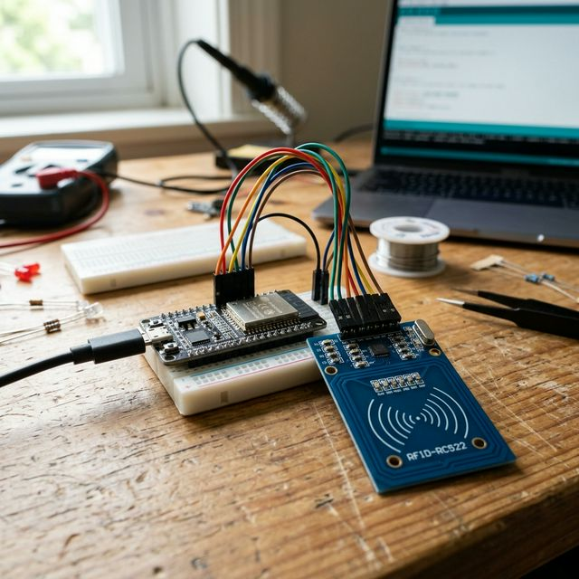
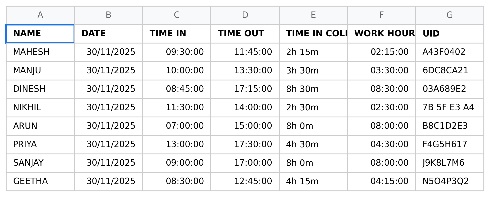
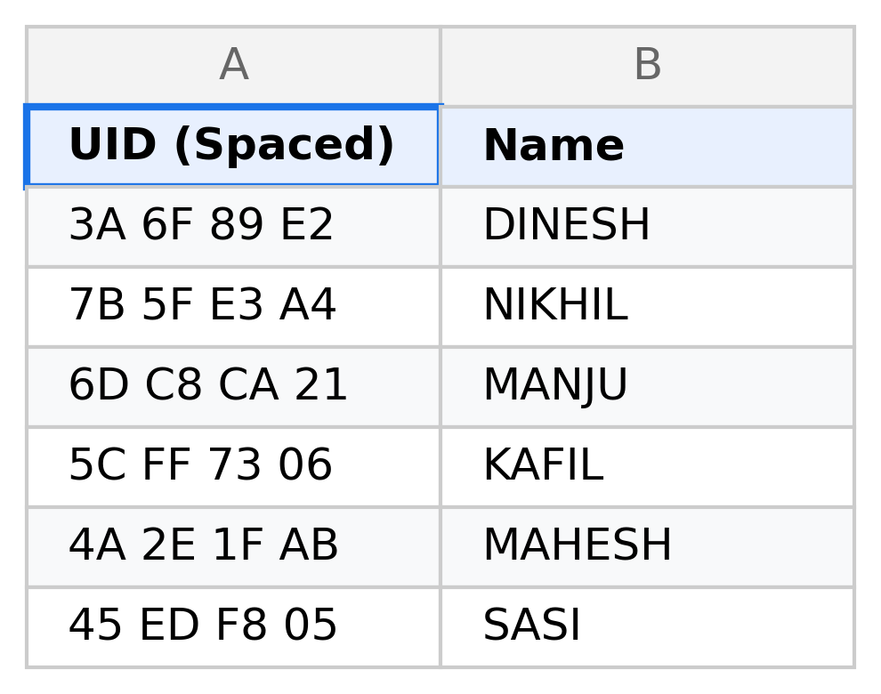
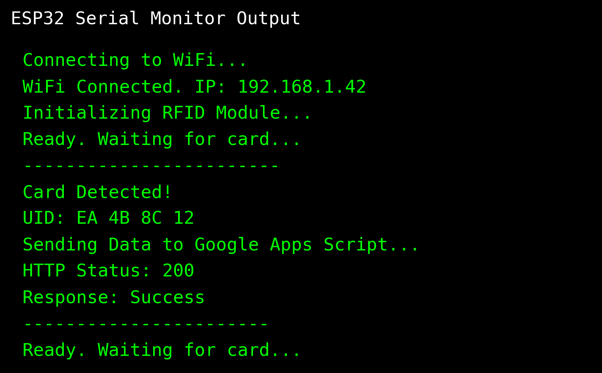

# 📡 RFID-Based ESP System Integrated with Google Sheets

## 🚀 Overview

This project uses an ESP microcontroller (ESP32/ESP8266) and an RC522 RFID module to scan cards and log user data directly into Google Sheets in real-time.

It can be used for:
- Attendance systems
- Access control
- Smart logging systems

## ⚙️ Tech Stack
- **ESP8266 / ESP32**
- **RFID Module (RC522)**
- **Arduino IDE**
- **Google Apps Script**
- **Google Sheets API**

## 🧠 System Architecture

**RFID Card** → **ESP** → **WiFi** → **Google Apps Script** → **Google Sheets**

## 🔌 Hardware Required
- ESP8266 / ESP32
- RC522 RFID Module
- Jumper wires
- Power supply

## ▶️ How to Run
1. Upload `arduino/rfid.ino` to your ESP board.
2. Connect the RFID module properly (SCK, MISO, MOSI, SDA pins).
3. Configure your WiFi credentials inside the `.ino` script.
4. Deploy the Google Apps Script (`appscript/Code.gs`) as a Web App.
5. Scan an RFID card → data automatically logs in the Google Sheet.

## 📊 Proof & Output

**1. 🌐 Live Web Dashboard Frontend:**
Instead of just a basic spreadsheet, this project features a fully functional real-time web dashboard app connected directly to the ESP32 logs! This UI includes search filtering, CSV exports, and admin controls.
👉 **[View the Live Web Dashboard Here 🚀](https://script.google.com/macros/s/AKfycbzwqYjyh5TOxTzNzU2E9Kxy8Zjon65Mqc-EBqAvsyzYAdeEpuC74XNDr3EUpf2nK-365A/exec)**

**2. Hardware Setup:**

**3. Google Sheets Logging Backend:**

🟢 **[Check Live Attendance Google Sheet Logs 📈](https://docs.google.com/spreadsheets/d/1WBdEyzrm73N2hZQ6n-Fnz7-HTxhtyv8tRygfwBeS1JM/edit?gid=0#gid=0)**

**4. Registered Users Database:**

**5. ESP32 Serial Monitor:**

## 🔐 Security Notes
- No API keys exposed in the repository.
- Uses a secure Google Apps Script webhook endpoint.

## 🔥 Features
- **Functional Web Dashboard UI** with advanced filtering, CSV export, and Admin Controls
- **Real-time logging** with sub-second accuracy directly from hardware
- **Wireless communication** over local network
- **Scalable system** supporting multiple IoT node arrays to a single master sheet

## 🚧 Future Improvements
- Implement dual-factor hardware authentication
- Improve latency with an MQTT broker

## 📫 Contact
Dinesh – GitHub: [https://github.com/DINESH2841](https://github.com/DINESH2841)
